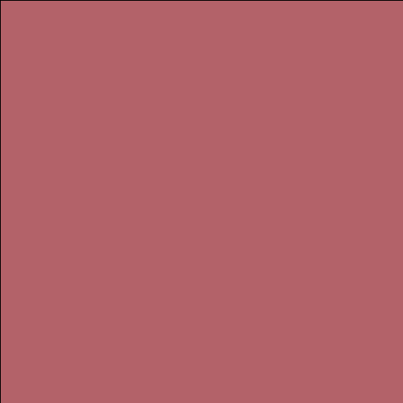

# Average color of image

This is a simple rust program that finds the average color of an image given a valid image path
  
## Usage

average_image_color.exe <path to image>

## Example
| Before | After |
| ------- | ------ |
|  |  |